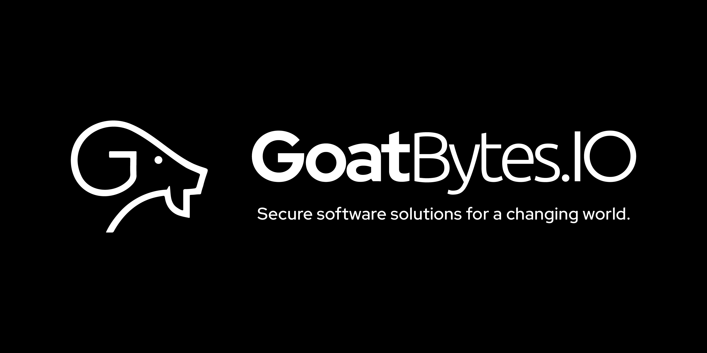

# kmmify - Kotlin Multiplatform Library Template

Welcome to kmmify, a comprehensive template designed to jumpstart your Kotlin Multiplatform library
projects. This template simplifies the creation and maintenance of cross-platform libraries,
enabling shared business logic across multiple platforms including iOS, Android, Web, and various
native platforms like Linux, watchOS, and tvOS. Kmmify is the perfect starting point for developers
looking to build robust, multiplatform solutions efficiently.


[](https://styles.goatbytes.io/lang/kotlin)


## Key Features

- **Extensive Multiplatform Support:** Configured for Android, iOS, Web, and Native platforms
  (including Linux, watchOS, and tvOS), ensuring broad compatibility and versatility.
- **Pre-configured Build System:** Includes ready-to-use Gradle scripts for building and testing
  your libraries.
- **Code Quality Assurance:** Set up with Detekt for static code analysis to maintain high code
  standards.
- **Documentation Ready:** Integrated with MkDocs and Dokka for generating comprehensive project
  documentation.
- **Release Signing:** Sign your artifacts before publishing for enhanced security and integrity.
- **GitHub Packages Publishing:** Easily publish your library to GitHub Packages with a single
  command.
- **CI/CD Ready:** Integrated with GitHub Actions for automated testing and deployment.

## Quick Start Guide

### Prerequisites

- Kotlin Multiplatform compatible IDE (IntelliJ IDEA recommended)

### Repository Setup

1. Click on the **Use this template** button to create a new repository from this template.
2. Clone the repository to your local machine using the following command:
   ```shell
   git clone https://github.com/goatbytes/kmmify.git
   ```
3. Modify the [`BuildConfig.kt`](buildSrc/src/main/kotlin/BuildConfig.kt) file with your project
   details.

### Static Code Analysis with Detekt

Run Detekt to ensure code quality:

```shell
./gradlew detektAll
```

### Generate Documentation

Generate project documentation using Dokka:

```shell
./gradlew dokkaHtml
```

### Publish Documentation to GitHub Pages

1. Install `mkdocs`:
   ```shell
   pip install mkdocs mkdocs-material pymdown-extensions mkdocs-minify-plugin mkdocs-git-revision-date-localized-plugin
   ```
2. Serve the documentation locally:
   ```shell
   mkdocs serve
   ```
3. Access the documentation at `http://localhost:8000`.
4. Publish the documentation to GitHub Pages:
   ```shell
   mkdocs gh-deploy
   ```

### Secure Publishing with Release Signing

Ensure your library is securely published by signing your artifacts before release:

#### Setup for Release Signing

To sign your releases, you need to generate signing keys. You can use tools like GPG or OpenSSL.
Then ensure the following properties are set in your `~/.gradle/gradle.properties` or passed via
environment variables:

- SIGNING_KEY_ID
- SIGNING_KEYRING
- SIGNING_PASSWORD

## Contributing

Contributions are welcome! Please read our [contributing guide](CONTRIBUTING.md) and submit pull
requests to our repository.

## License

Distributed under the Apache v2.0 License. See `LICENSE.txt` for more information.

## About GoatBytes.IO



At **GoatBytes.IO**, our mission is to develop secure software solutions that empower businesses to
transform the world. With a focus on innovation and excellence, we strive to deliver cutting-edge
products that meet the evolving needs of businesses across various industries.

[](https://github.com/goatbytes)
[](https://twitter.com/goatbytes)
[](https://www.linkedin.com/company/goatbytes)
[](https://www.instagram.com/goatbytes.io/)
