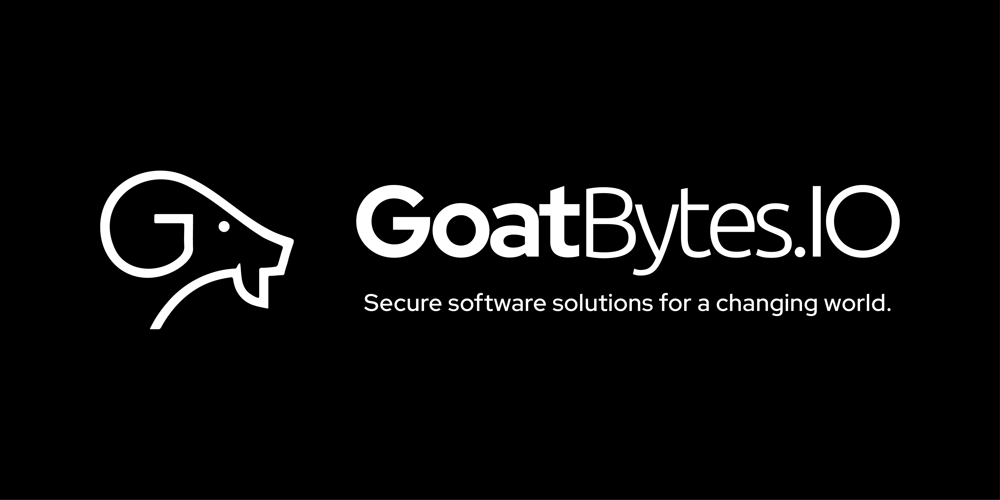

# Welcome to kmmify

Welcome to the official documentation for **kmmify**—a robust and refined template designed to
supercharge your Kotlin Multiplatform development. Our template simplifies the process of building
cross-platform applications by sharing business logic across iOS, Android, Web, and Desktop
platforms, while accommodating platform-specific nuances.

## Why kmmify?

**kmmify** was born out of a need to refine and optimize the official Kotlin Multiplatform Library
template. By reworking it significantly, we've tailored a template that not only meets the evolving
demands of modern software projects but also offers a streamlined setup process that gets you up and
running swiftly. This template is ideal for developers looking to leverage Kotlin Multiplatform's
true potential by facilitating shared codebases across multiple platforms.

## Features

- **Unified Project Structure**: Organize and maintain a single codebase that runs on all major
  platforms.
- **Pre-configured Build Scripts**: Jumpstart your development with ready-to-use Gradle scripts.
- **Integrated Code Analysis**: Maintain high-quality code with Detekt integrated for static code
  analysis.
- **Ready-to-Deploy Documentation**: Comes with MkDocs configuration for immediate project
  documentation setup.

## Getting Started

To get started with **kmmify**, clone the repository and build your project using the following
commands:

```shell
git clone https://github.com/goatbytes/kmmify.git
cd kmmify
./gradlew build
```

## About GoatBytes.IO



At **GoatBytes.IO**, our mission is to develop secure software solutions that empower businesses to
transform the world. With a focus on innovation and excellence, we strive to deliver cutting-edge
products that meet the evolving needs of businesses across various industries.

[](https://github.com/goatbytes)
[](https://twitter.com/goatbytes)
[](https://www.linkedin.com/company/goatbytes)
[](https://www.instagram.com/goatbytes.io/)